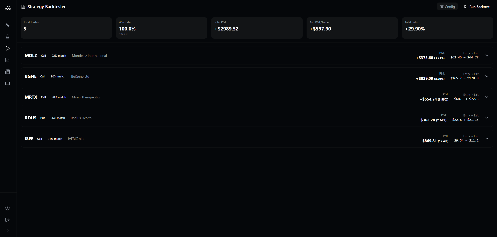
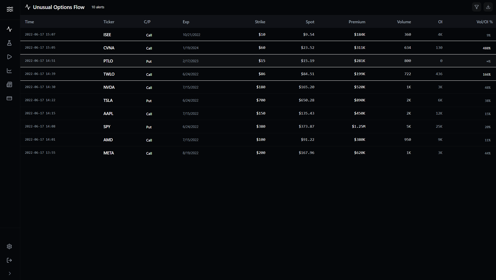

# Dark Pool / Biotech Catalysts Strategy


*Real-time dashboard visualizing Unusual Options Activity vs. Clinical Trial Dates.*


*Python Backtesting Engine processing signals.*

## Project Overview
This project correlates **Institutional Options Flow** (Dark Pools/Block Trades) with **Biotech Clinical Trial Events**. It identifies "silent" institutional positioning—where large money moves into a stock shortly before a catalyst event, despite no public news (SEC filings) being released.

### Quick Start Guide

**1. Config**
   - Check `config.json` if you want to tweak risk parameters (holding period, volume thresholds, etc).
   - The defaults are pretty conservative to prevent false positives.

**2. Data Requirements**
   - We process `Trady Flow` options data against `ctg-studies` (Clinical Trials).
   - Ensure these CSVs are in the root folder.

**3. Running the Strategy**
   - **Classic Backtester:**
     ```bash
     python backtester.py
     ```
   - **"Quiet Options" Strategy (Advanced):**
     ```bash
     python news_strategy.py
     ```
     *(This allows the algorithm to check real-time SEC EDGAR filings to confirm "insider" silence).*

**4. Frontend Visualization**
   - Navigate to the dashboard: `cd darkpool-pro`
   - Install dependencies: `npm install`
   - Run the updated UI: `npm run dev`

### Notes
- The entity matching engine uses fuzzy string matching to link Clinical Trial Sponsors to Stock Tickers.
- Historical SEC data is fetched via the EDGAR public API.
